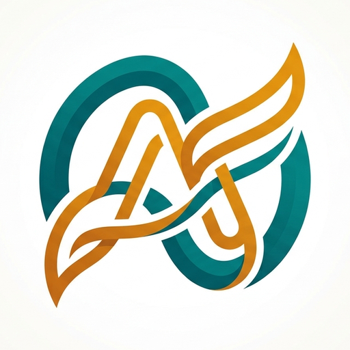

<div align="center">



# Apav

**Never miss an app update.**
Track your favourite Google Play apps and get notified the moment a new version arrives.


</div>

---

## About

Apav lets you add any app from the Google Play Store by pasting its link. It checks for new versions in the background, sends a notification when one appears, and highlights the app with an **UPDATE** badge so you can spot it instantly.

## Features

- **Add by link:** paste a Play Store link and Apav fetches the app name, icon and version.
- **Update highlight:** apps with a new version get an amber glow and an UPDATE badge, pinned to the top.
- **Background checks:** WorkManager checks every 1, 3, 6, 12 or 24 hours.
- **Notifications:** get alerted when a tracked app is updated.
- **Google Drive backup:** one-tap connect, choose any Gmail account, then back up and restore your list. Stored in Drive's hidden app folder, so Apav cannot see your other files.
- **Auto backup:** optionally back up after every check.
- **Glass bottom bar:** pill-shaped navigation with Home, Add (+), Drive and Settings.
- **Settings:** notification controls, check interval, Wi-Fi only, sort order, show only updated apps, tap behaviour, badge reset, delete all and more.
- **Aesthetic UI:** Material 3, Poppins font, teal and amber palette on a clean white background, animated splash screen.

## Tech stack

| Area | Library |
|---|---|
| Language | Java 17 |
| UI | Material Components (Material 3), RecyclerView, SwipeRefreshLayout |
| Database | Room |
| Background work | WorkManager |
| Networking and parsing | OkHttp, Jsoup |
| Images | Glide |
| Auth | Google Sign-In (`play-services-auth`) |
| Backup | Google Drive REST API (`drive.appdata` scope) |

## Build with GitHub Actions

No local setup needed. The workflow builds the APK for you.

1. Push this project to a GitHub repository (branch `main`).
2. Open **Actions → Build Apav APK → Run workflow** (it also runs on every push).
3. When it finishes, download **Apav-APK** from the **Artifacts** section.

### Signing secrets (needed for Google Drive sign-in)

Add these under **Settings → Secrets and variables → Actions**:

| Secret | Value |
|---|---|
| `KEYSTORE_BASE64` | output of `base64 -w0 apav.jks` |
| `KEYSTORE_PASSWORD` | keystore password (ASCII characters only) |
| `KEY_ALIAS` | key alias, e.g. `apav` |
| `KEY_PASSWORD` | key password (ASCII characters only) |

Create a keystore once and keep it safe:

```bash
keytool -genkeypair -v -keystore apav.jks -alias apav -keyalg RSA -keysize 2048 -validity 10000
keytool -list -v -keystore apav.jks -alias apav   # copy the SHA1 line
```

> Always sign with the same keystore. If it changes, the SHA-1 changes and Google Drive sign-in stops working.

## Google Drive setup

No Client ID is placed in the code. Google recognises the app by **package name + SHA-1**.

1. Open [Google Cloud Console](https://console.cloud.google.com) and create a project.
2. Enable **Google Drive API** (APIs & Services → Library).
3. Configure the **OAuth consent screen**: External, add the scope `.../auth/drive.appdata`, and add your Gmail as a **Test user**.
4. **Credentials → Create credentials → OAuth client ID → Android**
   - Package name: `com.tanzirdev.apav`
   - SHA-1: from your keystore
5. Install the APK, open the **Cloud** tab and tap **Connect Google Drive**.

Details are in [`SETUP_GOOGLE_DRIVE.md`](SETUP_GOOGLE_DRIVE.md).

| Error | Meaning |
|---|---|
| `10` | Package name or SHA-1 does not match the OAuth client |
| `12500` | Consent screen incomplete, or Gmail is not a test user |
| `403 accessNotConfigured` | Google Drive API is not enabled |

## Project structure

```
Apav/
├── .github/workflows/build.yml      # CI: builds debug (and release if signed)
├── SETUP_GOOGLE_DRIVE.md
└── app/src/main/
    ├── java/com/tanzirdev/apav/
    │   ├── SplashActivity.java      # animated splash
    │   ├── MainActivity.java        # glass bottom nav + fragments
    │   ├── HomeFragment.java        # app list, UPDATE highlight
    │   ├── AddSheet.java            # add app bottom sheet
    │   ├── DriveFragment.java       # connect, backup, restore
    │   ├── SettingsFragment.java    # settings
    │   ├── PlayScraper.java         # reads the Play Store page
    │   ├── Checker.java             # compares versions
    │   ├── UpdateWorker.java        # background schedule
    │   ├── Notifier.java            # notifications
    │   ├── DriveHelper.java         # Drive REST backup/restore
    │   └── Db.java, AppDao.java, AppItem.java   # Room
    └── res/                         # layouts, fonts, drawables, icons
```

## Known limitations

- Google Play has no public API for version checks, so Apav reads the public Play Store page. If Google changes its page layout, the two regex patterns in `PlayScraper.java` may need an update.
- Some apps show "Varies with device" as the version. For these, Apav compares the **Updated on** date instead.
- Checks are spaced out on purpose to avoid being rate limited by Google Play. Keep the interval reasonable.
- Intended for personal use. Scraping Google Play may conflict with its Terms of Service at large scale.

## Contributing

Issues and pull requests are welcome. For bigger changes, please open an issue first.

## Author

Built by **TanzirDev**.

---

<div align="center">Made with care for people who hate missing updates.</div>
